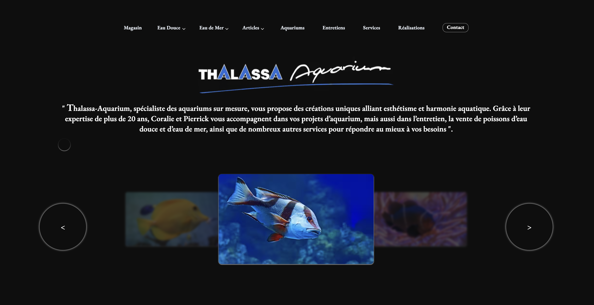
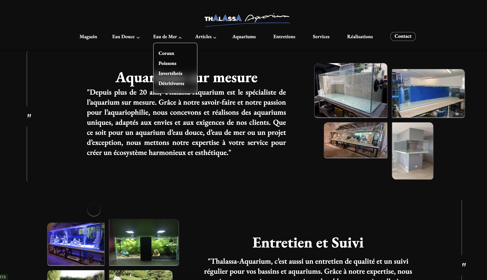
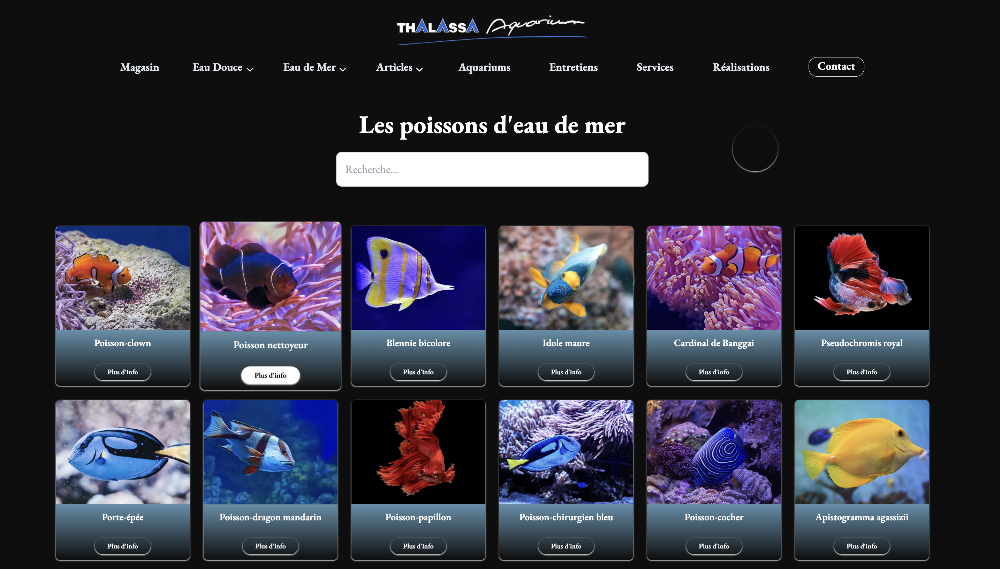
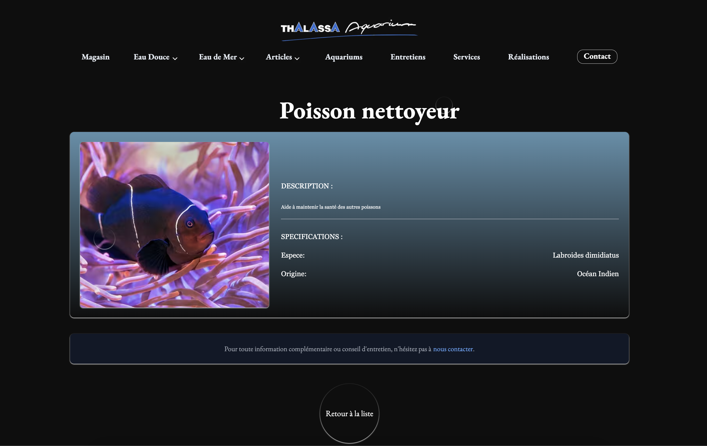
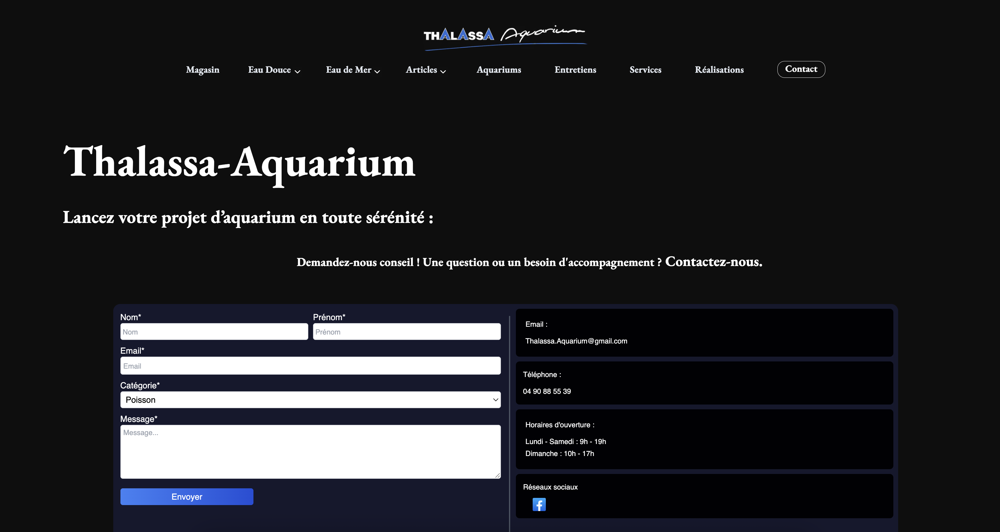

# Thalassa Aquarium :

> ⚠️ Ce dépôt est **privé** : seuls les visuels et une description du projet sont disponibles ici.  
> Pour un accès temporaire au code, veuillez me contacter directement.

Bienvenue dans le projet **Thalassa Aquarium**, un site dédié à la mise en avant des **articles disponibles** pour l’aquariophilie, avec des informations détaillées sur chaque espèce et produit, ainsi que des fonctionnalités pratiques pour les visiteurs.

## Objectif :

Créer un site vitrine responsive pour promouvoir Thalassa-Aquarium, ses articles, son savoir-faire, ainsi que ses espèces d'eau de mer et d'eau douce et activités. Le site permettra aux visiteurs d'accéder facilement aux informations essentielles sur l'aquariophilie, les produits et les services proposés.

## 🎨 Aperçu du projet

Voici quelques visuels de l’interface utilisateur :
## Accueil :

## Accueil contenu :

## page liste des poissons :

## page detail :

## page contact :

##  Fonctionnalités :

-  **Une recherche pour explorer les espèces et les articles** :

      - Ce filtrage ( eau de mer , eau douce ) est disponible sur la barre de navigation 
      - Une barre de recherche (search bar) a été intégrée sur chaque page afin de permettre une recherche affinée parmi les articles et les espèces vivantes.
      - La bibliothèque Fuse.js a été choisie pour sa simplicité d’utilisation et son poids léger, parfaitement adapté aux besoins du projet.

 - **Informations détaillées sur les espèces** :

      - Chaque fiche espèce ou article présente des informations complètes et structurées pour permettre aux utilisateurs d’en apprendre davantage sur l'article ou l'espèce en question.
      -  Le nom commun et le nom scientifique de l’espèce.
      -  Une image représentative pour une identification visuelle.
      -  La description de l’espèce
      -  Ces informations sont centralisées et affichées via une vue dédiée, souvent déclenchée par un clic sur une carte ou une liste.

  - **Design responsive pour une adaptabilité sur mobile et tablette** :

      - Utilisation de Flexbox et Grid pour une mise en page fluide.
      -  Définition de breakpoints adaptés aux tailles d’écrans courantes.
      -  Les composants s’adaptent dynamiquement : redimensionnement des images, modification des colonnes en lignes, ajustement des tailles de police et des espacements.
      -  Testé sur plusieurs navigateurs et résolutions pour assurer la compatibilité.

  - **Accessibilité** :

      - Contraste adapté pour garantir une lecture confortable, même en cas de déficiences visuelles.
      - Navigation entièrement possible au clavier pour une meilleure inclusivité.
      - Texte alternatif (`alt`) présent sur toutes les images afin d’assurer la compatibilité avec les lecteurs d’écran.

  - **Gestion des erreurs** :

      - Pages **404 personnalisées** pour informer l’utilisateur lorsque la page demandée n'existe pas.
      - Gestion des **erreurs de formulaire** ou de **serveur** avec des messages d'erreur clairs et adaptés, afin de guider l'utilisateur vers une résolution rapide.

  - **Mise en place d’un formulaire de mise en relation** :

      - Un **formulaire de contact** a été créé pour permettre aux utilisateurs de prendre contact avec l’entreprise, soit pour obtenir des informations supplémentaires, soit pour demander  un devis.
      - Le formulaire inclut des champs pour renseigner les **informations de contact** (nom, email, message) afin de faciliter une réponse personnalisée.
      - Une **validation des champs** a été mise en place pour s’assurer que toutes les informations nécessaires sont fournies. En cas de saisie incorrecte, des **messages d’erreur** sont  affichés pour guider l’utilisateur (ex. : champ obligatoire manquant).
      - Un message de **succès** est affiché après soumission, confirmant à l’utilisateur que sa demande a bien été envoyée et qu’il recevra une réponse sous peu.

## Back-end :

- **Fonctionnalités** :

    -  Le back-end de l’application est construit avec **Node.js** et **Express**, offrant une architecture solide et flexible pour la gestion des requêtes HTTP et des routes.
    -  L'application utilise l'architecture **MVC (Model-View-Controller)** pour séparer clairement la logique métier, les données et les vues. Cela permet de maintenir une structure claire et de faciliter les évolutions futures.
      
    - Model : Les modèles représentent la structure des données et sont utilisés pour interagir avec la base de données.
    - View : Bien que l'application soit principalement une API, une vue peut être renvoyée dans certains cas où des pages doivent être rendues.
    - Controller : Les contrôleurs gèrent la logique de traitement des requêtes, coordonnent l'accès aux modèles et renvoient les réponses appropriées.

    - Pour la gestion des données, nous utilisons une **base de données PostgreSQL**. Cette base relationnelle permet une gestion efficace des données structurées (utilisateurs, espèces, articles, etc.).
    - L’ORM **Sequelize** est utilisé pour faciliter l’interaction avec la base de données, permettant de manipuler les données de manière sécurisée et performante via des modèles.
    - Des **routes RESTful** sont mises en place pour exposer des endpoints permettant de récupérer, créer, mettre à jour et supprimer les données (CRUD).
    - Les données sont manipulées avec des requêtes optimisées, et la gestion des erreurs est mise en place pour renvoyer des messages clairs en cas d’échec.
    

## Technologies utilisées :

- **Frontend** : React, Tailwind CSS
- **Backend** : Node.js, Express, PostgreSQL
- **Outils** : Git, GitHub, Vite

Ce projet est un exemple concret de mes compétences en développement fullstack (React + Node + PostgreSQL).  
Il m’a permis de travailler dans des conditions proches du réel : modélisation de base de données, architecture MVC, accessibilité, responsive design et UX/UI.

👉 N’hésitez pas à me contacter pour un accès temporaire au code source ou une démonstration en direct.